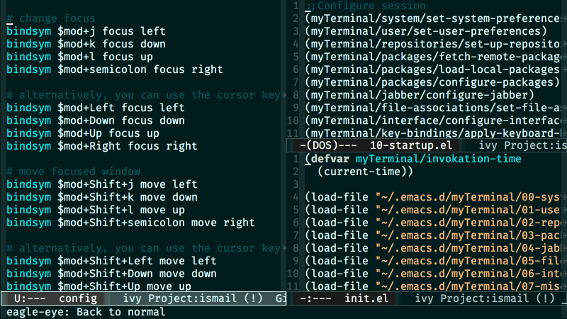

# eagle-eye

  

A utility to zoom-in and zoom-out while editing text

## Installation

### Manual

Save the file *eagle-eye.el* to disk and add the directory containing it to `load-path` using a command in your *.emacs* file like:

    (add-to-list 'load-path "~/.emacs.d/")

The above line assumes that you've placed the file into the Emacs directory '.emacs.d'.

Start the package with:

    (require 'eagle-eye)

### Marmalade

If you have Marmalade added as a repository to your Emacs, you can just install *eagle-eye* with

    M-x package-install eagle-eye RET

## Usage

Enable *eagle-eye-mode* in any buffer to scale down the text in that buffer by set scale. Disabling the minor-mode will bring the text size back to normal.

    (eagle-eye-mode)

You can also set key-bindings to functions `eagle-eye-zoom-in' and
`eagle-eye-zoom-out', so that you can change text size across Emacs at once.

    (global-set-key (kbd "C->") 'eagle-eye-zoom-in)

    (global-set-key (kbd "C-<") 'eagle-eye-zoom-out)

The *eagle-eye* text scaling can be set as

    (eagle-eye-set-text-scaling 5)

Also, you can set the step by which zooming in and zooming out happens by

    (eagle-eye-set-zoom-step 10)

By default, the *eagle-eye* text scaling is 5 and zoom step is 10.
